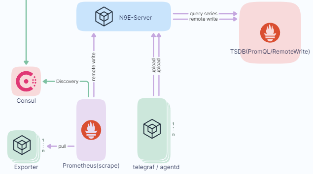

# Aliyun CloudMonitor Exporter

exporter for Aliyun CloudMonitor. Written in Golang.
inspired by [aliyun-exporter](https://github.com/fengxsong/aliyun-exporter)

## Develop

```bash
cd aliyun-exporter
make tidy
```

## Usage

```bash
# build
go build -o aliyun-exporter
# run
./aliyun-exporter serve
```

## 1. Based on configuration files
Provide a configuration file containing authentication information.
```yaml
credentials:
  # You can obtain monitoring data of multiple tenants by configuring multiple Tenant information.
  tenantId1:
    accessKey: xxxxxxxxxxxx
    accessKeySecret: xxxxxxxxxxxx
    region: cn-hangzhou
  tenantId2:
    accessKey: xxxxxxxxxxxx
    accessKeySecret: xxxxxxxxxxxx
    region: cn-hangzhou
```

### prometheus job
```yaml
- job_name: 'aliyun-exporter'
  scrape_interval: 60s
  scrape_timeout: 60s
#  # Docking with didi/nightingale
#  relabel_configs:
#    metric_relabel_configs:
#      - source_labels:
#        - instanceId
#        - cloudID
#        separator: ;
#        target_label: ident
  static_configs:
  - targets: ['aliyun-exporter:9527']

## Docking with didi/nightingale
#remote_write:
#  - url: "http://$n9e-server:19000/prometheus/v1/write"
#    # Configures the queue used to write to remote storage.
#    queue_config:
#      # Number of samples to buffer per shard before we start dropping them.
#      capacity: 10000
#      # Maximum number of shards, i.e. amount of concurrency.
#      max_shards: 1
#      # Maximum number of samples per send.
#      max_samples_per_send: 500
```
You can visit metrics in http://aliyun-exporter:9527/metrics

## 2. Based on request parameters.
In this way, the authentication information of the configuration file will be ignored, and all authentication information needs to be provided through the parameters in the get request.

You can visit http://aliyun-exporter:9527/, and you will know what parameters are required for this method, Such as: http://127.0.0.1:9527/monitors?tenant=xxxx&accessKey=xxxx&accessKeySecret=xxxx&regionId=cn-hangzhou

This method can be combined with consul:

### Register for consul service
```shell
curl -X PUT -d '{"id": "aliyun-exporter001","name": "aliyun-exporter001","address": "aliyun-exporter","port": 9527,"tags": ["aliyun-exporter"],"Meta":{"tenant":"aliyun-exporter001","accessKey":"xxxx","accessKeySecret":"xxxx","regionId":"xxxx"},"checks": [{"http": "http://aliyun-exporter:9527/healthz", "interval": "30s"}]}' http://consul:8500/v1/agent/service/register
```

### prometheus job
vi /etc/prometheus/prometheus.yml
```yaml
  - job_name: "aliyun-exporter"
    honor_timestamps: true
    scrape_interval: 3m
    scrape_timeout: 20s
    metrics_path: /monitors
    scheme: http
    relabel_configs:
      - source_labels: [__meta_consul_tags]
        separator: ;
        regex: .*aliyun-exporter.*
        replacement: $1
        action: keep
      - source_labels: [__meta_consul_service_metadata_tenant]
        separator: ;
        regex: (.*)
        target_label: __param_tenant
        replacement: $1
        action: replace
      - source_labels: [__meta_consul_service_metadata_accessKey]
        separator: ;
        regex: (.*)
        target_label: __param_accessKey
        replacement: $1
        action: replace
      - source_labels: [__meta_consul_service_metadata_accessKeySecret]
        separator: ;
        regex: (.*)
        target_label: __param_accessKeySecret
        replacement: $1
        action: replace
      - source_labels: [__meta_consul_service_metadata_regionId]
        separator: ;
        regex: (.*)
        target_label: __param_regionId
        replacement: $1
        action: replace
##    Docking with didi/nightingale
#    metric_relabel_configs:
#      - source_labels:
#          - instanceId
#          - __param_tenant
#        separator: ;
#        target_label: ident
    consul_sd_configs:
      - server: consul:8500
        tag_separator: ','
        scheme: http
        allow_stale: true
        refresh_interval: 30s

## Docking with didi/nightingale
#remote_write:
#  - url: "http://$n9e-server:19000/prometheus/v1/write"
#    # Configures the queue used to write to remote storage.
#    queue_config:
#      # Number of samples to buffer per shard before we start dropping them.
#      capacity: 10000
#      # Maximum number of shards, i.e. amount of concurrency.
#      max_shards: 1
#      # Maximum number of samples per send.
#      max_samples_per_send: 500
```

Compatible with [didi/nightingale](https://github.com/didi/nightingale)


### dashboard
[Instance Dashboard](dashboards/Aliyun-Instance-Dashboard.json)

## Limitation

- an exporter instance can only scrape metrics from single region (Done)
- ...

## TODO

- dynamic rate limiter

## Ref

- https://partners-intl.aliyun.com/help/doc-detail/51939.htm?spm=a2c63.p38356.b99.150.7c8312d7lwqVVC
- https://partners-intl.aliyun.com/help/doc-detail/163515.htm?spm=a2c63.p38356.a3.4.326357304ihN0P
- https://github.com/aliyun/alibaba-cloud-sdk-go
